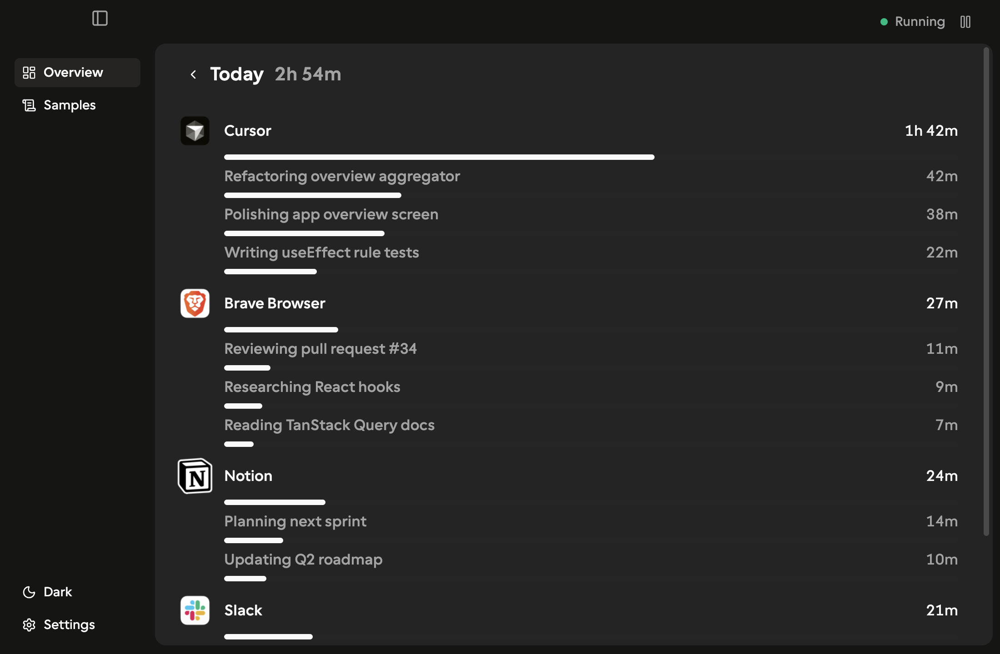

<p align="center">
  
</p>

<h1 align="center">slowblink</h1>

<p align="center">
  Screen Time, but it tells you what you <em>actually</em> did.
</p>

<p align="center">
  <a href="https://github.com/AlanChen4/slowblink/releases/latest"><strong>Download for macOS →</strong></a>
</p>

---

- **See what you actually did.** Not "Chrome, 2h" — "Researched React hooks, 47m."
- **Local-first.** Activity stays in a SQLite file on your Mac. Screenshots are discarded after analysis.
- **Two ways to use it.** Free with your OpenAI key, or $8/month for hosted AI + sync.

## Plans

|             | Free                 | Pro — $8/month                          |
| ----------- | -------------------- | --------------------------------------- |
| **AI**      | Your OpenAI API key  | Hosted by slowblink, with PII filtering |
| **Sync**    | This Mac only        | Across all your Macs                    |
| **History** | Forever, on this Mac | Forever, on this Mac + cloud            |
| **Sign-in** | Not required         | Google sign-in                          |

Pro starts with a 14-day free trial — card required up front, cancel any time before day 14 with no charge.

## First run

1. Grant **Screen Recording** in System Settings → Privacy & Security
2. Grant **Accessibility** in the same place
3. Pick a plan in slowblink's onboarding — add an [OpenAI API key](https://platform.openai.com/api-keys) or start a Pro trial

## Privacy

All activity data stays on your Mac. Screenshots are sent to your AI provider for analysis but never written to disk. Full details in [PRIVACY.md](PRIVACY.md).

## Development

```bash
pnpm install
pnpm dev
```

## License

[MPL-2.0](LICENSE)
